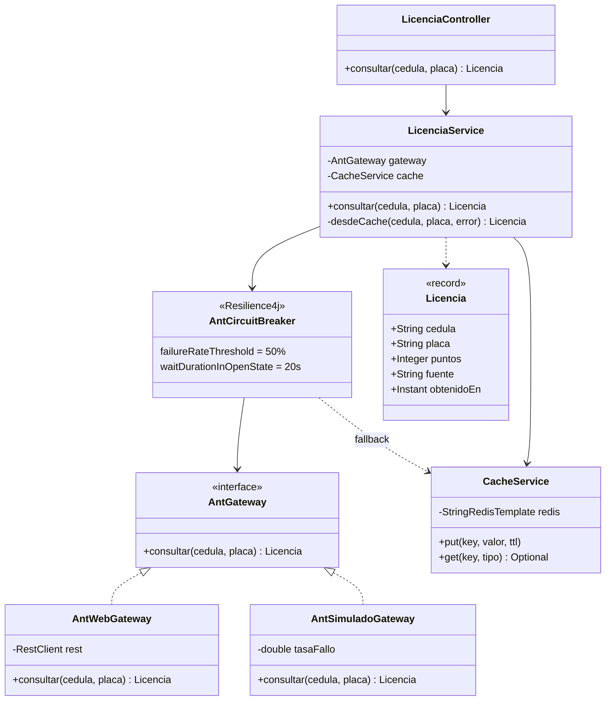
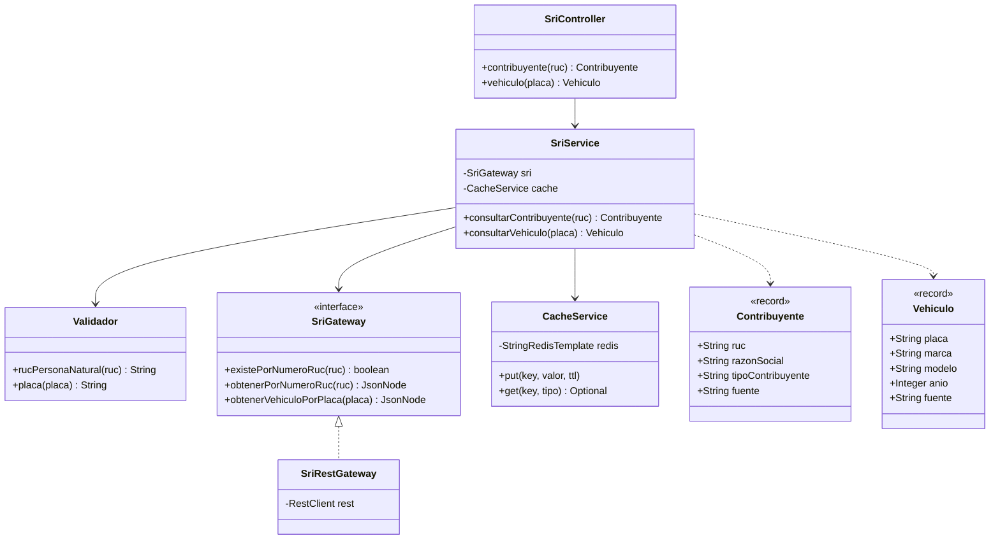

# C4 Nivel 4 – Código

## ms-ant (Circuit Breaker + Cache)

```mermaid
classDiagram
  class LicenciaController {
    +consultar(cedula, placa) Licencia
  }
  class LicenciaService {
    -AntGateway gateway
    -CacheService cache
    +consultar(cedula, placa) Licencia
    -desdeCache(cedula, placa, error) Licencia
  }
  class AntCircuitBreaker {
    <<Resilience4j>>
    failureRateThreshold = 50%
    waitDurationInOpenState = 20s
  }
  class AntGateway {
    <<interface>>
    +consultar(cedula, placa) Licencia
  }
  class AntWebGateway {
    -RestClient rest
    +consultar(cedula, placa) Licencia
  }
  class AntSimuladoGateway {
    -double tasaFallo
    +consultar(cedula, placa) Licencia
  }
  class CacheService {
    -StringRedisTemplate redis
    +put(key, valor, ttl)
    +get(key, tipo) Optional
  }
  class Licencia {
    <<record>>
    +String cedula
    +String placa
    +Integer puntos
    +String fuente
    +Instant obtenidoEn
  }
  LicenciaController --> LicenciaService
  LicenciaService --> AntCircuitBreaker
  AntCircuitBreaker --> AntGateway
  AntCircuitBreaker ..> CacheService : fallback
  LicenciaService --> CacheService
  AntGateway <|.. AntWebGateway
  AntGateway <|.. AntSimuladoGateway
  LicenciaService ..> Licencia
```

## ms-sri (Cache-Aside)

```mermaid
classDiagram
  class SriController {
    +contribuyente(ruc) Contribuyente
    +vehiculo(placa) Vehiculo
  }
  class SriService {
    -SriGateway sri
    -CacheService cache
    +consultarContribuyente(ruc) Contribuyente
    +consultarVehiculo(placa) Vehiculo
  }
  class Validador {
    +rucPersonaNatural(ruc) String
    +placa(placa) String
  }
  class SriGateway {
    <<interface>>
    +existePorNumeroRuc(ruc) boolean
    +obtenerPorNumeroRuc(ruc) JsonNode
    +obtenerVehiculoPorPlaca(placa) JsonNode
  }
  class SriRestGateway {
    -RestClient rest
  }
  class CacheService {
    -StringRedisTemplate redis
    +put(key, valor, ttl)
    +get(key, tipo) Optional
  }
  class Contribuyente {
    <<record>>
    +String ruc
    +String razonSocial
    +String tipoContribuyente
    +String fuente
  }
  class Vehiculo {
    <<record>>
    +String placa
    +String marca
    +String modelo
    +Integer anio
    +String fuente
  }
  SriController --> SriService
  SriService --> Validador
  SriService --> SriGateway
  SriService --> CacheService
  SriGateway <|.. SriRestGateway
  SriService ..> Contribuyente
  SriService ..> Vehiculo
```
